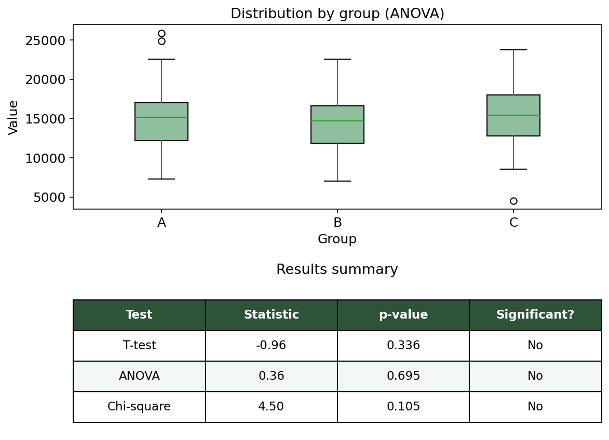

# Statistical Hypothesis Testing Template

A reusable Python template for running standard statistical hypothesis tests on tabular datasets, with results exported to a clean Excel summary.

## What it does

This notebook walks through a complete statistical analysis workflow:

1. **Data loading** — reads a dataset (Excel/CSV)
2. **Exploratory Data Analysis (EDA)** — checks structure, missing values, and descriptive statistics
3. **T-test** — compares the average of a numeric variable between two groups
4. **ANOVA** — compares the average of a numeric variable across three or more groups
5. **Chi-square test** — tests for association between two categorical variables
6. **Excel export** — generates a summary table with test statistics, p-values, and plain-language interpretation

## Example output



## Tools

- Python
- pandas
- scipy.stats
- matplotlib
- openpyxl (for Excel export)

## How to use it

1. Clone this repository
2. Open `statistical_analysis_template.ipynb`
3. Replace the sample dataset in the "Load data" section with your own:
   ```python
   df = pd.read_excel("your_dataset.xlsx")
   ```
4. Adjust column names in the test sections to match your dataset
5. Run all cells — results and the Excel summary will be generated automatically

## About

Built by [Margionet](https://github.com/margiofabiolad) — physicist with a background in astrophysics research, now working in data analysis and statistics.

This template is also offered as a freelance service on [Upwork](https://www.upwork.com).
